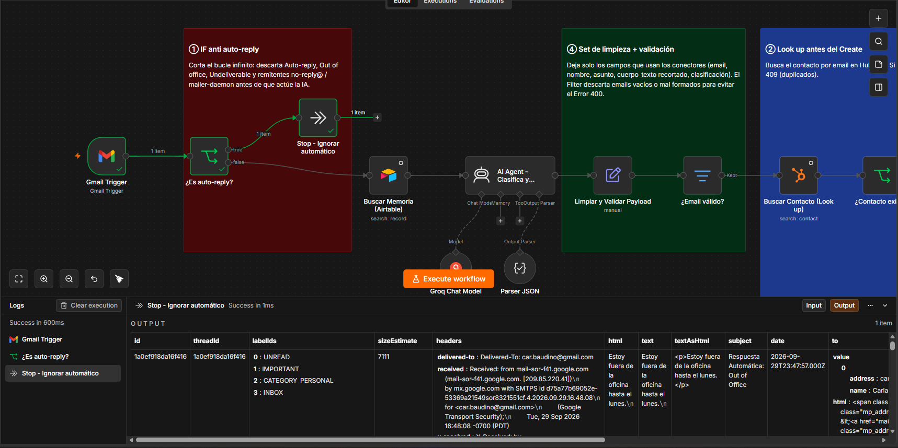
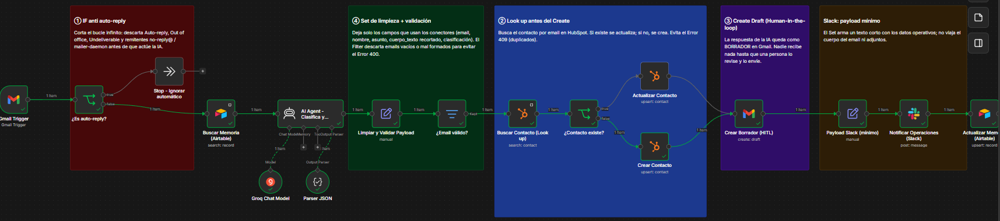
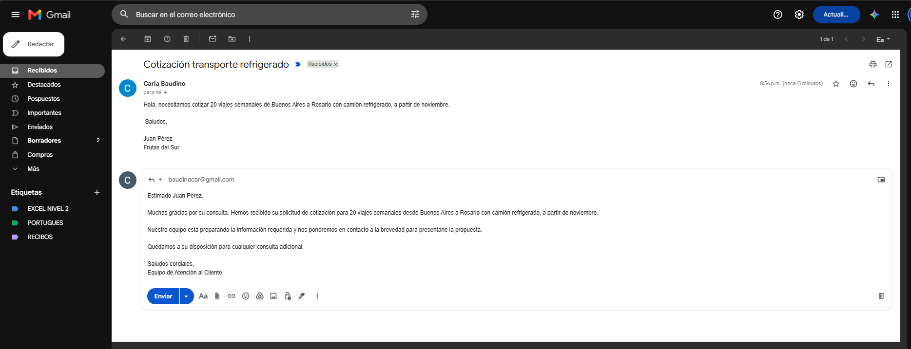
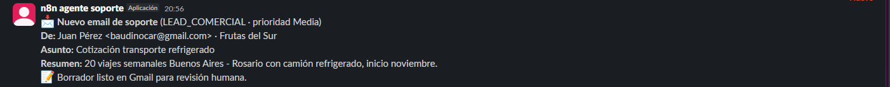
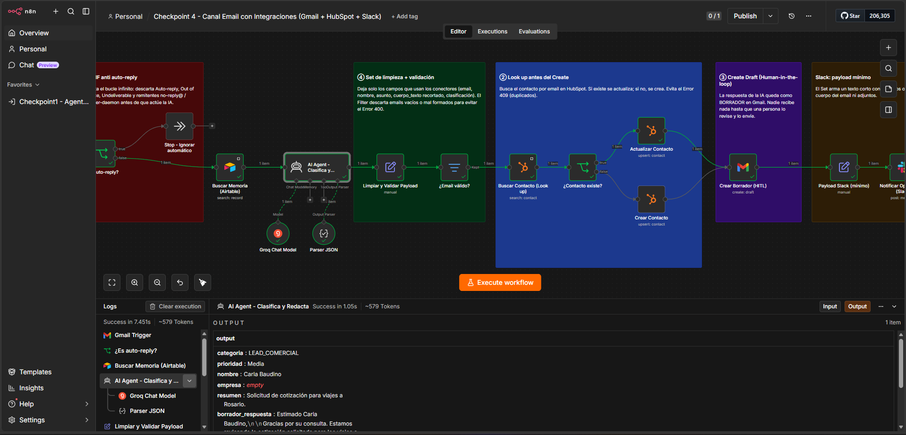
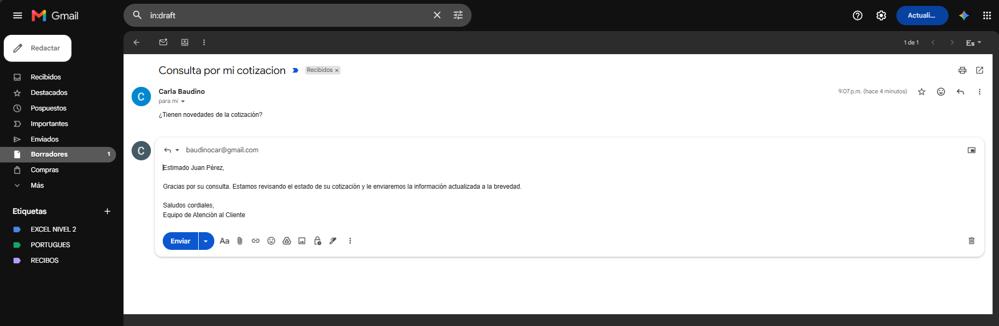
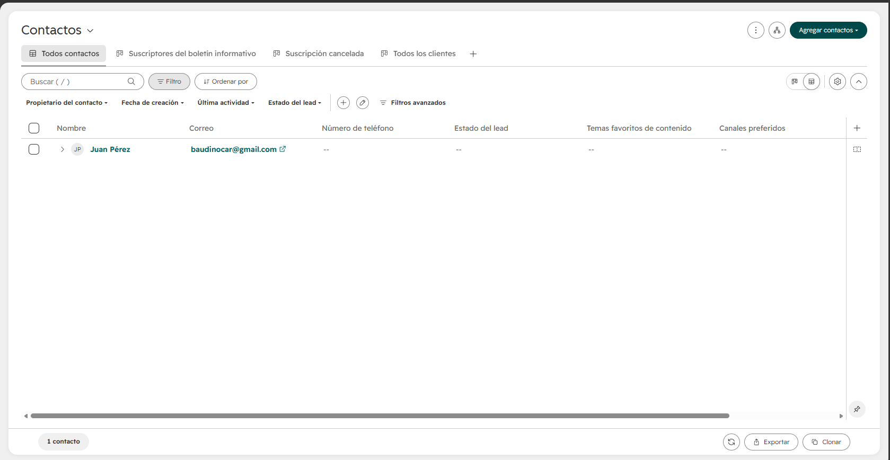

# Checkpoint 4 · Integraciones avanzadas (Gmail + HubSpot + Slack)

**Alumna:** Carla Baudino · **Curso:** AI Automation Avanzado · **Archivo:** [`checkpoint4_carla_baudino.json`](checkpoint4_carla_baudino.json)

Es la evolución del proyecto integrador (agente de atención de una empresa logística). Al orquestador con memoria del Módulo 3 se le suma un **canal de email**: el agente lee la casilla de soporte, sincroniza el contacto con el CRM, deja la respuesta como borrador para revisión humana y avisa al equipo de Operaciones por Slack. La memoria de largo plazo en Airtable es la misma del Módulo 3; en este canal, el `Session_ID` es el email del remitente.

## Flujo

```
Gmail Trigger
   │
① ¿Es auto-reply? ── true ──▶ Stop - Ignorar automático
   │ false
Buscar Memoria (Airtable)
   │
AI Agent - Clasifica y Redacta   (Groq + Parser JSON)
   │
④ Limpiar y Validar Payload ──▶ ¿Email válido?   (descarta emails vacíos o mal formados → evita el 400)
   │
② Buscar Contacto (Look up) ──▶ ¿Contacto existe?
        ├─ true  ──▶ Actualizar Contacto
        └─ false ──▶ Crear Contacto          (evita el 409)
   │
③ Crear Borrador (HITL)
   │
Payload Slack (mínimo) ──▶ Notificar Operaciones (Slack)
   │
Actualizar Memoria (Airtable)
```

## Los 4 nodos de la rúbrica

| # | Nodo en el lienzo | Qué hace |
|---|---|---|
| ① | `¿Es auto-reply?` | IF inmediatamente posterior al trigger. Condición **OR**, sin distinguir mayúsculas: el asunto contiene *auto-reply, autoreply, automatic reply, respuesta automática, out of office, fuera de la oficina, undeliverable, delivery status notification, mail delivery*, o el remitente contiene *no-reply, noreply, mailer-daemon, postmaster*. La salida `true` termina en `Stop - Ignorar automático` y corta el bucle. |
| ② | `Buscar Contacto (Look up)` → `¿Contacto existe?` | Busca en HubSpot con `email EQ {{email}}` (límite 1, *Always Output Data* activado). Si el contacto existe, `Actualizar Contacto` solo toca la empresa. Si no existe, `Crear Contacto` lo da de alta como *lead*. |
| ③ | `Crear Borrador (HITL)` | Gmail, recurso **Draft**, operación **Create**. El borrador queda en el mismo hilo (`threadId`) y dirigido al remitente. **No hay ningún nodo Send en el workflow.** |
| ④ | `Limpiar y Validar Payload` + `¿Email válido?` | El Set deja solo los campos del contrato (tabla de abajo), recorta el cuerpo a 1000 caracteres sin saltos de línea y calcula `email_valido` con una regex. El Filter descarta los ítems inválidos antes de llegar al CRM. |

**Búsqueda de memoria (`Buscar Memoria (Airtable)`):** comparación directa entre la columna `Session_ID` y el email del remitente, en minúsculas.

| | Fórmula |
|---|---|
| Configurada en el nodo | `{Session_ID} = '{{ $json.from.value[0].address.toLowerCase() }}'` |
| Resuelta en ejecución (ejemplo) | `{Session_ID} = 'juan@frutasdelsur.com'` |

`Actualizar Memoria (Airtable)` guarda la misma clave (email en minúsculas) con la operación *Create or Update*, usando `Session_ID` como columna de coincidencia. Así cada remitente mantiene una sola fila.

Además, `Payload Slack (mínimo)` arma un único campo `texto_slack` antes de `Notificar Operaciones (Slack)`: al canal no viajan el cuerpo del email, los headers ni los adjuntos.

## Autenticación y mínimo privilegio

| Conector | Credencial en n8n | Permisos concedidos | Operaciones usadas |
|---|---|---|---|
| Gmail (casilla de soporte) | Gmail OAuth2 (app propia de Google Cloud, n8n self-hosted) | Los scopes de Gmail que pide n8n | Lectura: Trigger (INBOX, no leídos). Escritura: **solo Draft → Create** |
| HubSpot (CRM) | HubSpot Service Key (clave de servicio) | `crm.objects.contacts.read`, `crm.objects.contacts.write` | Search, Create or Update de **contactos**. Sin acceso a deals, tickets ni otros objetos |
| Slack (canal de Operaciones) | Slack API, Bot User OAuth Token | `chat:write` | Post de mensajes en `#operaciones`, que es el único canal al que se invitó al bot |
| Airtable (memoria M3) | Personal Access Token | `data.records:read`, `data.records:write`, limitado a la base *Memoria Agente* | Search y Create or Update por `Session_ID` |
| Groq (LLM) | API Key | — | Clasificación y redacción |

En HubSpot (clave de servicio, que reemplazó a las Private Apps) y Slack (Bot Token), los tokens se emiten desde la app de cada plataforma, en el mismo paso donde se eligen los scopes. Así el alcance queda limitado desde el origen.

## Contrato de datos: salida de `Limpiar y Validar Payload`

| Campo | Tipo | Obligatorio | Origen | Lo usa |
|---|---|---|---|---|
| `email` | string | **Sí** | `from.value[0].address` (trim + minúsculas) | Look up, Crear/Actualizar Contacto, Borrador, Memoria |
| `email_valido` | boolean | **Sí** | regex sobre el remitente | `¿Email válido?` |
| `thread_id` | string | **Sí** | `threadId` del email | Borrador (mismo hilo) |
| `asunto` | string | **Sí** | `subject` (máx. 150 caracteres, o "(sin asunto)") | Borrador, Slack |
| `categoria` | string: `LEAD_COMERCIAL` · `RECLAMO_OPERATIVO` · `OTRO` | **Sí** | AI Agent | Slack, Memoria |
| `prioridad` | string: `Alta` · `Media` · `Baja` | **Sí** | AI Agent | Slack |
| `borrador_respuesta` | string | **Sí** | AI Agent | Borrador |
| `resumen` | string (máx. 30 palabras) | **Sí** | AI Agent | Slack, Memoria |
| `nombre` | string | No (puede ir vacío) | AI Agent o nombre del remitente | Crear Contacto, Slack, Memoria |
| `empresa` | string | No (puede ir vacío) | AI Agent | Crear/Actualizar Contacto, Slack |
| `cuerpo_texto` | string (máx. 1000 caracteres) | No | `text` del email, limpio | Auditoría (no se envía a Slack) |

**Ejemplo de ítem válido (continúa el flujo):**
```json
{
  "email": "juan@frutasdelsur.com",
  "email_valido": true,
  "thread_id": "192a7f3c5e8b1d24",
  "asunto": "Cotización transporte refrigerado",
  "categoria": "LEAD_COMERCIAL",
  "prioridad": "Media",
  "borrador_respuesta": "Estimado Juan: le agradecemos su consulta...",
  "resumen": "Cotización de 20 viajes semanales refrigerados Buenos Aires - Rosario desde noviembre",
  "nombre": "Juan Pérez",
  "empresa": "Frutas del Sur",
  "cuerpo_texto": "Hola, necesitamos cotizar 20 viajes semanales..."
}
```

**Ejemplo de ítem inválido (lo descarta `¿Email válido?` y no llega a HubSpot):**
```json
{
  "email": "",
  "email_valido": false,
  "thread_id": "192a7f3c5e8b1d99",
  "asunto": "(sin asunto)",
  "categoria": "OTRO",
  "prioridad": "Baja",
  "borrador_respuesta": "",
  "resumen": "Email sin remitente identificable",
  "nombre": "",
  "empresa": "",
  "cuerpo_texto": ""
}
```

## Pruebas de regresión (29/09/2026)

Se ejecutaron manualmente con **Execute workflow**, cada una con un email real enviado a la casilla de soporte desde otra cuenta.

| Caso | Email de prueba | Resultado obtenido |
|---|---|---|
| 1. Auto-reply | Asunto `Respuesta Automática: Out of Office` | `¿Es auto-reply?` salió por `true` y se ejecutó solo `Stop - Ignorar automático`. La IA, HubSpot y Gmail no se ejecutaron. ✅ |
| 2. Contacto nuevo | `Cotización transporte refrigerado` (Juan Pérez, Frutas del Sur) | Clasificado como `LEAD_COMERCIAL` con prioridad Media → `Crear Contacto` en HubSpot → borrador en el mismo hilo de Gmail → aviso en `#operaciones` → fila en Airtable. ✅ |
| 3. Contacto existente | `Consulta por mi cotización` (mismo remitente) | `¿Contacto existe?` salió por `true` → `Actualizar Contacto`. HubSpot sigue con **1 contacto**, sin duplicado. El email no tenía firma y el remitente de Gmail muestra otro nombre, pero el borrador saluda a "Juan Pérez" porque el nombre se toma primero de la memoria de Airtable. ✅ |

### Evidencia

**Prueba 1: el IF corta el auto-reply antes de la IA**


**Prueba 2: recorrido completo con contacto nuevo**




**Prueba 3: contacto existente, se actualiza sin duplicar**




## Cómo importarlo

1. En n8n: **Workflows → Import from File** y elegí `checkpoint4_carla_baudino.json`.
2. Asigná las credenciales: Gmail OAuth2, HubSpot Service Key, Slack API, Airtable y Groq.
3. En los dos nodos de Airtable, elegí la base y la tabla de memoria. Tienen que tener las columnas `Session_ID`, `Nombre`, `Estado del Caso`, `Resumen Consolidado`, `Acción Requerida` y `Fecha de Actualización`.
4. En `Notificar Operaciones (Slack)`, elegí el canal.
