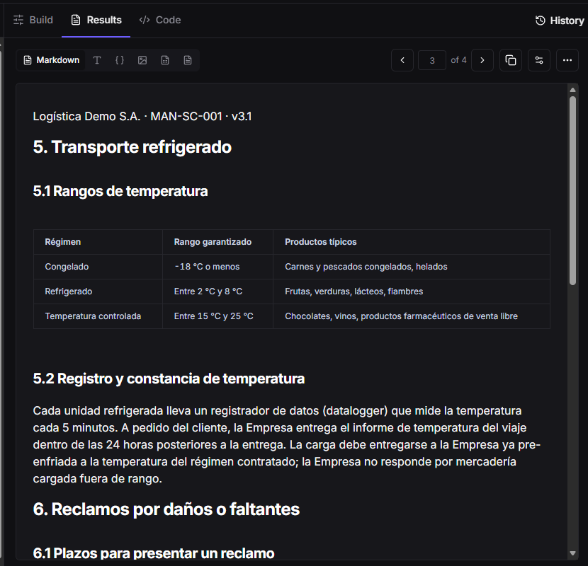
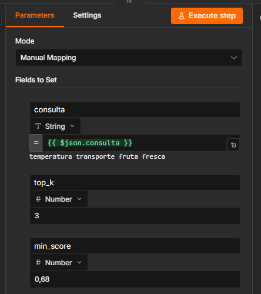
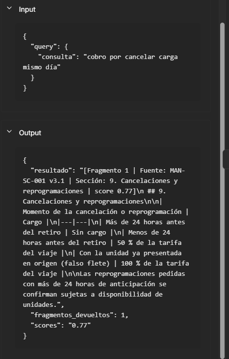
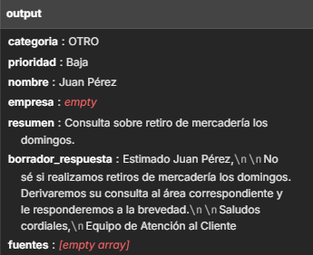

# Checkpoint 5 · RAG: Agente con Conocimiento Organizacional

El agente de email del Checkpoint 4 ahora responde las consultas de políticas con el **Manual de Políticas y Procedimientos de Servicio (MAN-SC-001 v3.1)** de Logística Demo S.A., un documento ficticio creado para el curso.

| Archivo | Rol |
|---|---|
| [`checkpoint5_carla_baudino.json`](checkpoint5_carla_baudino.json) | Agente de email con la herramienta `buscar_manual_politicas` y el prompt RAG |
| [`checkpoint5_base_conocimiento_rag.json`](checkpoint5_base_conocimiento_rag.json) | Sub-workflow con dos carriles: A · ingesta del manual y B · herramienta de búsqueda (Top-K + Minimum Score) |
| [`manual_politicas_limpio.md`](manual_politicas_limpio.md) | Salida de LlamaParse ya limpia, que es lo que se indexa |
| [`Manual_Politicas_Servicio_Logistica_Demo.pdf`](Manual_Politicas_Servicio_Logistica_Demo.pdf) | Documento original |
| [`PreEntrega_Modulo5_CarlaBaudino.pdf`](PreEntrega_Modulo5_CarlaBaudino.pdf) | Documento entregado: las 5 piezas de la rúbrica |

## Pipeline

```
LlamaParse (Cost-Effective) ─▶ limpieza (encabezados, tabla partida, títulos, HTML→Markdown)
   ─▶ 1 fragmento por sección (13) ─▶ embeddings Gemini ─▶ Simple Vector Store
AI Agent ─▶ buscar_manual_politicas ─▶ Top-K = 3 ─▶ Minimum Score ≥ 0,68 ─▶ fragmentos con sección y score
```

## Calibración

| Parámetro | Valor | Por qué |
|---|---|---|
| Top-K | 3 | El fragmento correcto salió 1.º en las 4 preguntas con respuesta; el contexto queda acotado a ~750 tokens |
| Minimum Score | 0,68 | Fragmentos correctos: 0,73–0,80. Ruido: ≤ 0,65. Con 0,68 llega solo el fragmento útil |

## Prueba ciega (5 preguntas por email)

| # | Pregunta | Resultado |
|---|---|---|
| 1 | ¿A cuántos grados llevan la fruta fresca? | ✅ 2–8 °C (sección 5.1) |
| 2 | Cajas rotas adentro, detectadas 2 días después | ✅ Daño oculto, hasta 72 h (sección 6) |
| 3 | Aviso a la mañana que no cargamos a la tarde | ✅ 50 % de la tarifa (sección 9) |
| 4 | ¿Cuánto tarda hasta Bariloche? | ⚠️ Correcto (Patagonia, 96–120 h), pero infirió la provincia fuera del manual |
| 5 | ¿Retiran los domingos? | ✅ "No sé" (sin fragmentos sobre el umbral) |

Precisión: **5/5**, sin alucinaciones.

## Evidencias





## Cómo importarlo
1. Importar `checkpoint5_base_conocimiento_rag.json`, asignar la credencial de Gemini en los dos nodos de embeddings, **publicarlo** y ejecutar **Ejecutar Ingesta** (13 fragmentos).
2. Importar `checkpoint5_carla_baudino.json` y, en `buscar_manual_politicas`, elegir el sub-workflow desde la lista. Asignar las credenciales de Gmail, Airtable, HubSpot, Slack y Groq.
3. La base de vectores vive en memoria: después de reiniciar n8n hay que volver a ejecutar la ingesta.
