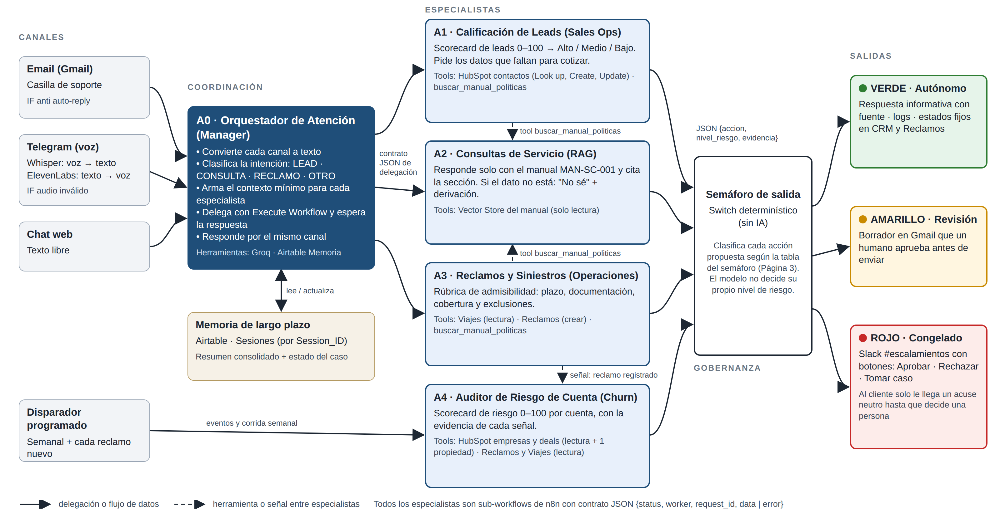

# Checkpoint 7 · Diseño arquitectónico de un sistema agéntico vertical

**Alumna:** Carla Baudino · **Curso:** AI Automation Avanzado · **Entrega:** [`PreEntrega_Modulo7_CarlaBaudino.pdf`](PreEntrega_Modulo7_CarlaBaudino.pdf)

Este checkpoint es un **documento de diseño**, sin workflow nuevo en n8n. Muestra cómo se especializa para su industria el agente que el proyecto viene construyendo desde el Módulo 1.

**Vertical:** transporte y logística B2B · Customer Service & Sales Ops.
**Organización:** Logística Demo S.A. (ficticia).

## Contenido del informe

| Página de la consigna | Qué incluye |
|---|---|
| 1. Relevamiento del proceso y framework de priorización | Problema operativo, baseline manual (≈ 271 h/mes en 4 procesos) y framework con 3 vectores ponderados: impacto 40 %, viabilidad no-code 35 %, adopción 25 %. Incluye los accesos regulados y las olas de implementación. |
| 2. Arquitectura multi-agente y mapa de permisos | Diagrama, ficha de cada agente (misión, System Prompt, herramientas y JSON que entrega), mapa de permisos de mínimo privilegio y Context Engineering por sub-workflow. |
| 3. Propuesta de valor y semáforo de riesgo (HITL) | Propuesta en lenguaje comercial, 8 KPIs con baseline y meta a 90 días, semáforo verde / amarillo / rojo como lista blanca y protocolo de escalado en Slack con los botones Aprobar · Rechazar · Tomar caso. |
| 4. Scorecards y versión de portafolio | Scorecard de leads (0–100), rúbrica de admisibilidad de reclamos basada en el manual MAN-SC-001, scorecard de riesgo de churn y versión de portafolio anonimizada. |

## Red de agentes

| Agente | Rol | Reutiliza |
|---|---|---|
| A0 · Orquestador de Atención | Clasifica la intención y delega con un contrato JSON | Router del M2 · memoria del M3 |
| A1 · Calificación de Leads | Scorecard de leads y HubSpot, sin cotizar precios | Agente del M1 · HubSpot del M4 |
| A2 · Consultas de Servicio (RAG) | Responde solo con el manual; si no está, dice "No sé" | RAG del M5 · voz del M6 |
| A3 · Reclamos y Siniestros | Arma un expediente completo y pre-evaluado para Operaciones | Worker de reclamos del M2 |
| A4 · Auditor de Riesgo de Cuenta | Scorecard de churn con evidencia de cada señal | Nuevo en este diseño |
| Semáforo de salida | Switch determinístico, sin IA: decide qué acciones son autónomas y cuáles requieren aprobación humana | Patrón HITL del M4 |

El **Checkpoint 8** implementa sobre el canal de voz la capa de control de calidad (Juez LLM + Human-in-the-loop) que este diseño plantea.
