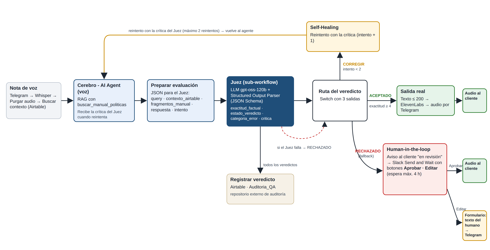
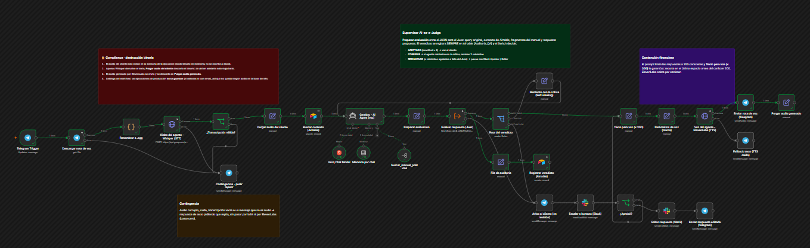
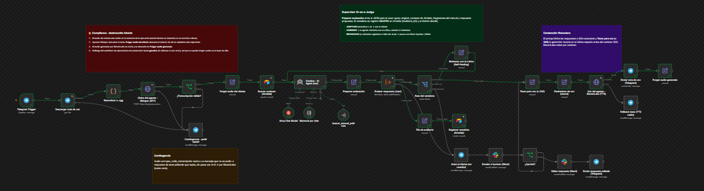
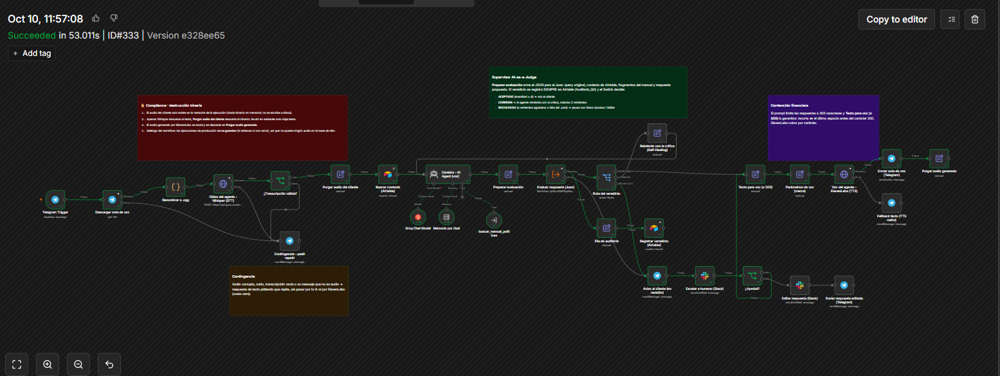
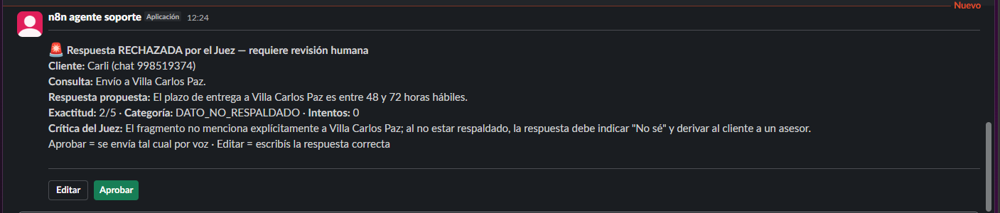

# Checkpoint 8 · QA automatizado con AI-as-a-Judge

**Alumna:** Carla Baudino · **Curso:** AI Automation Avanzado · **Entrega:** [`Checkpoint_Modulo8_Baudino_Carla.pdf`](Checkpoint_Modulo8_Baudino_Carla.pdf)

Al canal de voz del Checkpoint 6 (Telegram + Whisper + RAG + ElevenLabs) se le suma una **capa de supervisión**. Un Juez LLM con salida JSON forzada evalúa cada respuesta antes de que llegue al cliente, y un Switch decide entre tres rutas:

- **ACEPTADO:** se envía la respuesta.
- **CORREGIR:** el agente reintenta con la crítica del Juez (Self-Healing).
- **RECHAZADO:** se escala a un humano en Slack (Human-in-the-loop).

## Archivos

| Archivo | Qué es |
|---|---|
| [`checkpoint8_juez.json`](checkpoint8_juez.json) | Sub-workflow **Juez**: Basic LLM Chain (Groq `gpt-oss-120b`, temperatura 0) + Structured Output Parser con JSON Schema. Si el LLM falla, devuelve un veredicto RECHAZADO. |
| [`checkpoint8_canal_voz_supervisado.json`](checkpoint8_canal_voz_supervisado.json) | El canal de voz del M6 con el Juez, el Switch de 3 rutas, el registro en Airtable y la escalación a Slack. |
| [`checkpoint8_test_ab.json`](checkpoint8_test_ab.json) | Banco de pruebas A/B: 5 casos por arquitectura, uno por vez, con una pausa de 45 s para respetar el límite de tokens de Groq. |
| [`auditoria_qa.csv`](auditoria_qa.csv) | Exportación de la tabla `Auditoria_QA` de Airtable: los veredictos del test A/B y de producción. |

## Flujo de supervisión

| Salida del Switch | Condición | Acción |
|---|---|---|
| ACEPTADO | `estado_veredicto = ACEPTADO` y `exactitud_factual ≥ 4` | Texto ≤ 200 → ElevenLabs → audio por Telegram |
| CORREGIR | `estado_veredicto ≠ RECHAZADO` e `intento < 2` | "Reintento con la crítica" vuelve al agente (máximo 2 reintentos) |
| RECHAZADO | Fallback (incluye reintentos agotados o falla del Juez) | Aviso al cliente → Slack *Send and Wait* con **Aprobar / Editar** (espera máxima 4 h) |

Cada veredicto se registra en **Airtable (`Auditoria_QA`)**: es el repositorio externo de auditoría.

**Salida del Juez (JSON Schema):** `exactitud_factual` (entero de 1 a 5) · `estado_veredicto` (`ACEPTADO` | `CORREGIR` | `RECHAZADO`) · `categoria_error` · `critica`.

## Resultados del test A/B (5 + 5 corridas, mismo Juez v3)

| | A · `gpt-oss-120b` | B · `gpt-oss-20b` |
|---|---|---|
| Precisión media (1 a 5) | **4,4** | 4,0 |
| Aceptadas por el Juez | **80 %** | 60 % |
| Coincidencia del Juez con la revisión humana | 5/5 | 5/5 |
| Costo del agente por corrida | USD 0,000264 | USD 0,000131 |
| Costo total proyectado cada 1.000 ejecuciones (IA + humano) | **≈ USD 8,76** | ≈ USD 16,70 |

**Error más frecuente:** `DATO_NO_RESPALDADO` (el agente ubica en su provincia una ciudad que el manual no nombra).
**Recomendación:** mantener A con el Juez activo.

## Evidencia en producción

| Ruta | Ejecución |
|---|---|
| ACEPTADO |  |
| CORREGIR → ACEPTADO |  |
| RECHAZADO → Slack → Aprobar |  |

## Cómo importarlo

1. Tener el Checkpoint 5 (base de conocimiento RAG) **publicado** y con la ingesta ejecutada.
2. En la base de Airtable *Memoria Agente*, crear la tabla `Auditoria_QA` con estas columnas:
   - Fecha, Execution_ID, Canal, Arquitectura, Veredicto, Categoria_Error, Caso, Modelo, Estado_Ejecucion
   - Intento, Exactitud (número)
   - Query, Respuesta, Critica, Esperado (texto largo)
3. Importar `checkpoint8_juez.json`, asignar la credencial de Groq y **publicarlo**.
4. Importar los otros dos workflows. En **Evaluar respuesta (Juez)**, elegir el Juez con **From list**. En los nodos de Airtable, elegir la base y la tabla. En los nodos de Slack, asignar la credencial y el canal.
5. Telegram admite un solo webhook por bot: despublicar el Checkpoint 6 antes de publicar el canal supervisado.
